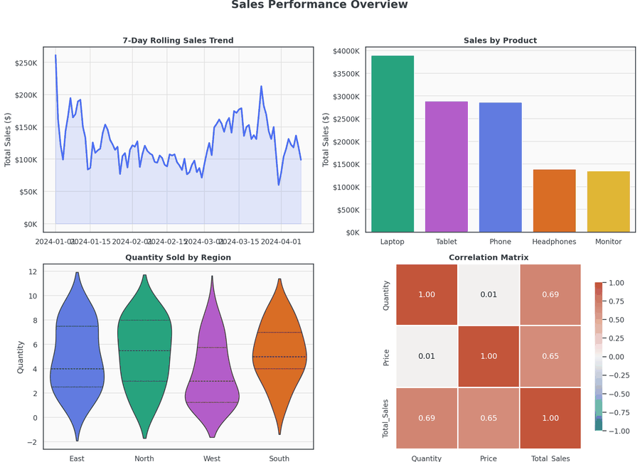

#  Interactive Sales Dashboard

A complete exploratory data analysis and visualization project built on a
100-record sales dataset (Jan 1 – Apr 9, 2024). The project combines
**Seaborn** statistical plots with a fully **interactive Plotly** dashboard
(dropdown menus, hover tooltips, and time-based animation).



## What's inside

| File / Folder | Description |
|---|---|
| `sales_dashboard.ipynb` | Full analysis notebook — data cleaning, feature engineering, every chart, and commentary. Run top-to-bottom to reproduce everything. ||
| `visualizations/` | All exported chart images (`.png`) plus the interactive dashboard (`interactive_dashboard.html`). |
| `requirements.txt` | Python dependencies. |
| `report.md` | Written report: methodology, findings, and recommendations. |
| `dashboard_demo.gif` | Short animated preview of the dashboard's charts. |
| `sales_data.csv` | Source dataset. |
| `DOCUMENTATION.docx` |
| `test_dashboard` |

## Setup

```bash
python -m venv venv
source venv/bin/activate        # Windows: venv\Scripts\activate
pip install -r requirements.txt
```

## Usage

 **Notebook (recommended, shows analysis + commentary):**
```bash
jupyter notebook dashboard.ipynb
```
```

Then open `visualizations/interactive_dashboard.html` in any browser to use
the interactive dashboard — no server or Jupyter kernel required.

## Dataset

`sales_data.csv` — 100 rows, 7 columns:

- `Date` — transaction date
- `Product` — Phone, Headphones, Laptop, Tablet, or Monitor
- `Quantity` — units sold in the order
- `Price` — unit price ($)
- `Customer_ID` — unique customer identifier (one order per customer in this dataset)
- `Region` — East, North, South, or West
- `Total_Sales` — `Quantity * Price`

## Chart types included

**Seaborn (static, saved as PNG):**
1. Line plot — daily sales trend + 7-day rolling average
2. Bar plot — total sales by product
3. Box plot — price distribution by product, with a one-way ANOVA annotation
4. Violin plot — quantity sold distribution by region
5. Heatmap — correlation matrix (Quantity, Price, Total Sales)
6. Count plot — customer value-tier segmentation by region
7. Combined 2×2 dashboard grid — all four core views, one coordinated theme

**Plotly (interactive, embedded in `interactive_dashboard.html`):**
1. Sales trend line chart with a **Region dropdown filter**
2. Product performance bar chart with a **metric-switching dropdown** (Total Sales / Units Sold / Avg Price)
3. Interactive correlation heatmap with hover tooltips
4. **Animated bubble chart** — customer segmentation over time (play/slider by month), bubble size = order value, color = region

## Notes on `dashboard_demo.gif`

The GIF is a lightweight animated preview stitched from static frames of the
key charts (a full screen-recording of live cursor interaction wasn't
possible in this environment). For the real interactive experience — hover
tooltips, dropdowns, and the play/slider animation — open
`visualizations/interactive_dashboard.html` directly in a browser.
